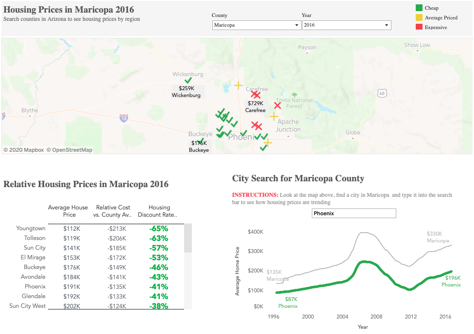

# Tableau Dashboard Examples
Examples of simple dashboards created and hosted on Tableau Public. A thumbnail picture is also provided for each example dashboard that shows a preview of what you would find on the public repository. **Note: some of the dashboards might look slightly different**

---

## Dashboard 1: Housing Prices in Arizona
Example of a dashboard that helps a user explore housing prices by county in Arizona. The data was found on [Kaggle's](https://www.kaggle.com/moezabid/zillow-all-homes-data "Data Location") website. The data was not in friendly format for Tableau so preprocessing was done with this [Jupyter Notebook](./data_preprocessing.ipynb).

[Link to dashboard on Tableau Public](https://public.tableau.com/profile/chris.matthews#!/vizhome/ArizonaHomePrices/HomePriceDashboard?publish=yes "Tableau Public Website")

---

---
