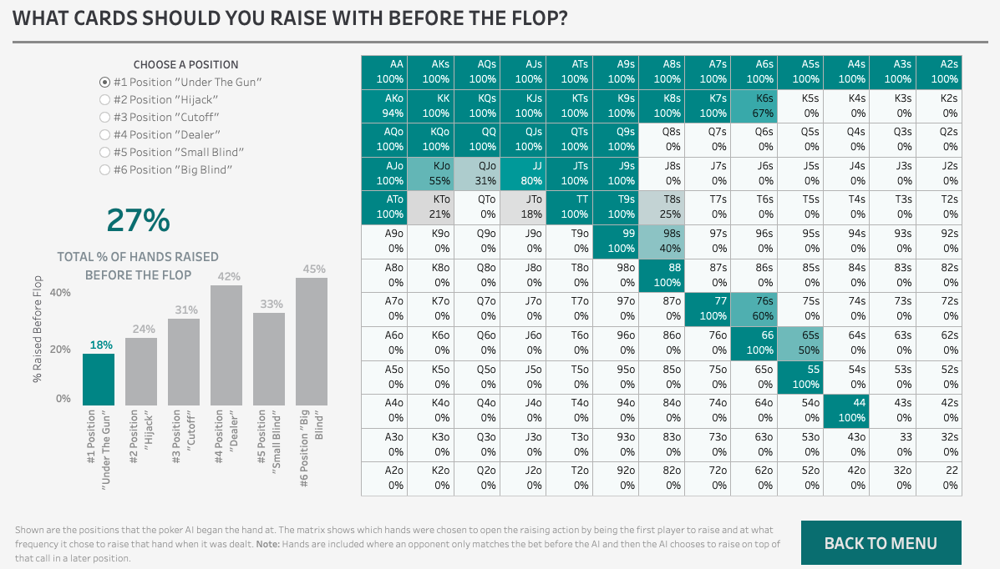

# Tableau Dashboard Examples
Examples of simple dashboards created and hosted on Tableau Public. A thumbnail picture is also provided for each example dashboard that shows a preview of what you would find on the public repository. **Note: some of the dashboards might look slightly different**

---

## Dashboard 1: Housing Prices in Arizona
Example of a dashboard that helps a user explore housing prices by county in Arizona. The data was found on [Kaggle's](https://www.kaggle.com/moezabid/zillow-all-homes-data "Data Location") website. The data was not in friendly format for Tableau so preprocessing was done with this [Jupyter Notebook](./data_preprocessing.ipynb).

[Link to dashboard on Tableau Public](https://public.tableau.com/profile/chris.matthews#!/vizhome/ArizonaHomePrices/HomePriceDashboard "Tableau Public Website")

---

## Dashboard 2: How To Play Poker Like An AI Robot
This dashboard explores strategies used by an AI poker robot to beat the best
human players in the world. The data source and articles can be found in a link
in the dashboard.

[Link to dashboard on Tableau Public](https://public.tableau.com/profile/chris.matthews#!/vizhome/HowToPlayPoker/DashIntro)

---
